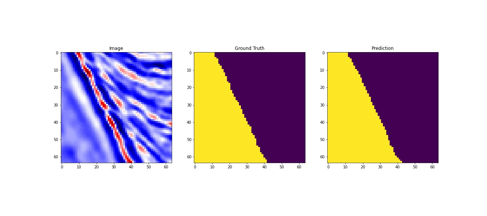
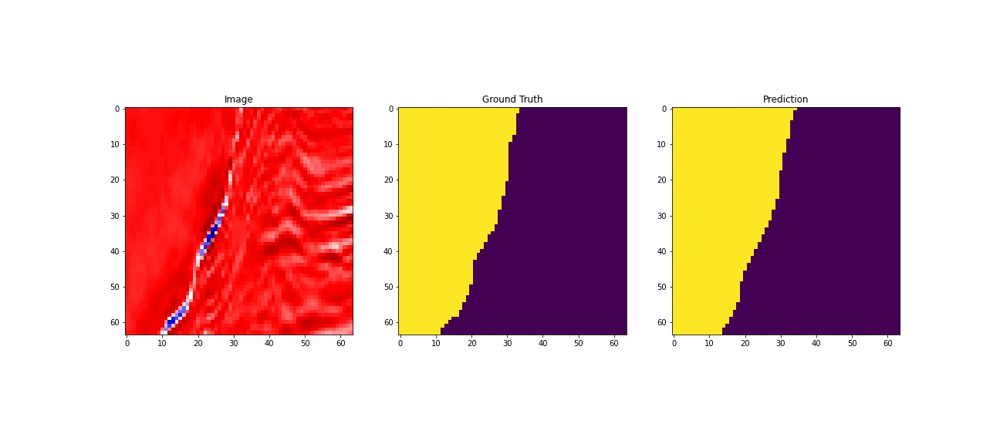
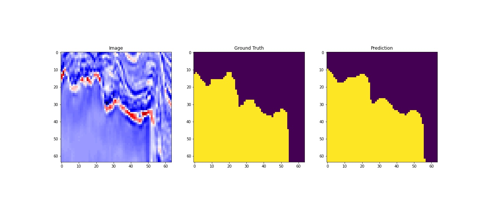

## MultiResUNet : Rethinking the U-Net architecture for multimodal biomedical image segmentation

This repository contains the  implementation of "MultiResUNet : Rethinking the U-Net architecture for multimodal biomedical image segmentation" in pytorch.

### Paper

MultiResUNet has been published in Neural Networks

>Ibtehaz, Nabil, and M. Sohel Rahman. "MultiResUNet: Rethinking the U-Net architecture for multimodal biomedical image segmentation." Neural Networks 121 (2020): 74-87.

* [Read the Paper](https://doi.org/10.1016/j.neunet.2019.08.025)
* [View the Preprint](https://arxiv.org/abs/1902.04049)
* [Original keras(tensorflow backend) implementation](https://github.com/nibtehaz/MultiResUNet)

## Results

<<<<<<< HEAD
    

    

    
=======
    

    

    
>>>>>>> e409370d31f3b2839a1c5500dd4c95efad98d5e8

