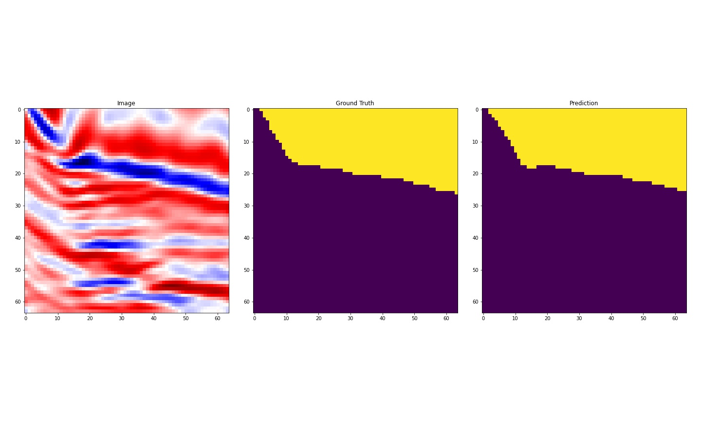
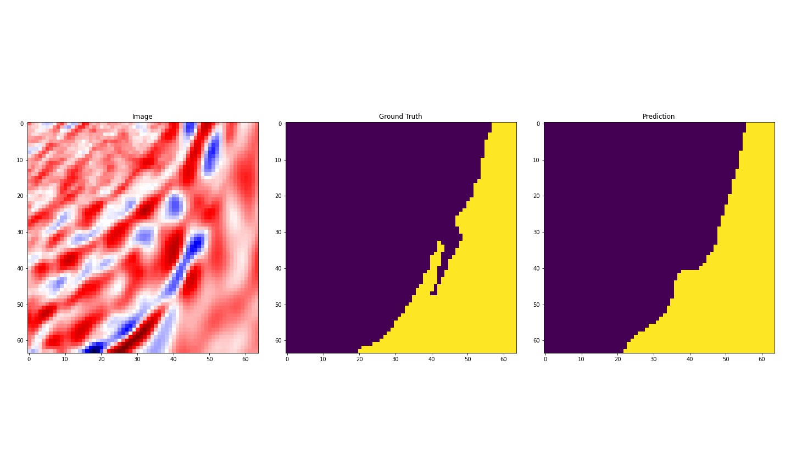

### MultiResUNet : Rethinking the U-Net architecture for multimodal biomedical image segmentation

This repository contains the  implementation of "MultiResUNet : Rethinking the U-Net architecture for multimodal biomedical image segmentation" in pytorch.

### Paper

MultiResUNet has been published in Neural Networks

>Ibtehaz, Nabil, and M. Sohel Rahman. "MultiResUNet: Rethinking the U-Net architecture for multimodal biomedical image segmentation." Neural Networks 121 (2020): 74-87.

* [Read the Paper](https://doi.org/10.1016/j.neunet.2019.08.025)
* [View the Preprint](https://arxiv.org/abs/1902.04049)
* [Original keras(tensorflow backend) implementation](https://github.com/nibtehaz/MultiResUNet)

#### Usage
<pre><code>
from multiresunet import MultiResUnet  
net = MultiResUnet(channels=3,filters=16,nclasses=1)    

"""
Arguments : 

channels - input image channels
filters - filters to begin with (Unet)
nclasses - number of classes
"""

</code></pre>

* [Dataset - TGS Salt Identification Challenge ](https://www.kaggle.com/c/tgs-salt-identification-challenge/data)

#### Results

    

    

